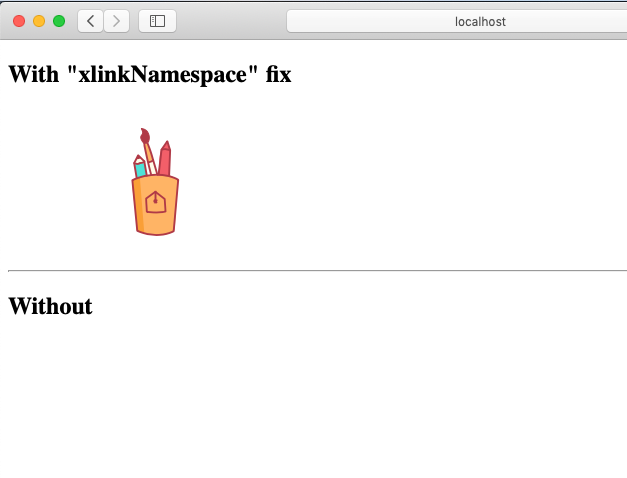
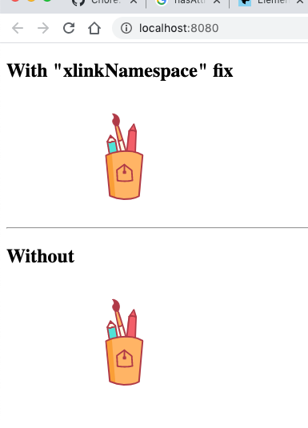

TypeScript Webpack lit-html svg xlink fix for Safari Demo
=======================================

在其它的浏览器中，引用外部的svg文件时，可以使用`href`属性，比如：`<use href="sample.svg#Layer_1"/>`

但是在safari中，必须使用`xlink:href`。

这里利用了lit-html中的directive功能，定义了一个`xlinkNamespace`的directive，可以帮助我们自动添加xlink的属性。

```
npm install
npm run demo
```

In safari:



In chrome:

